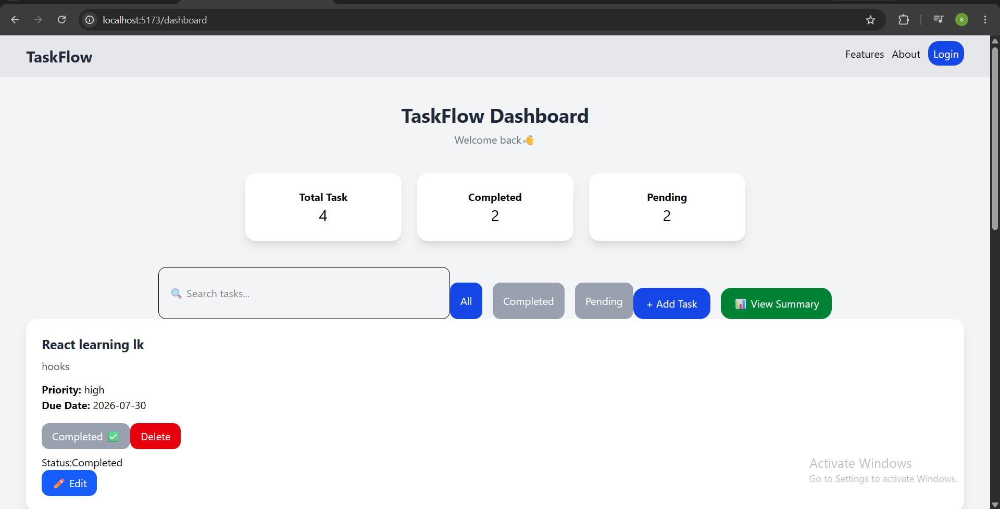
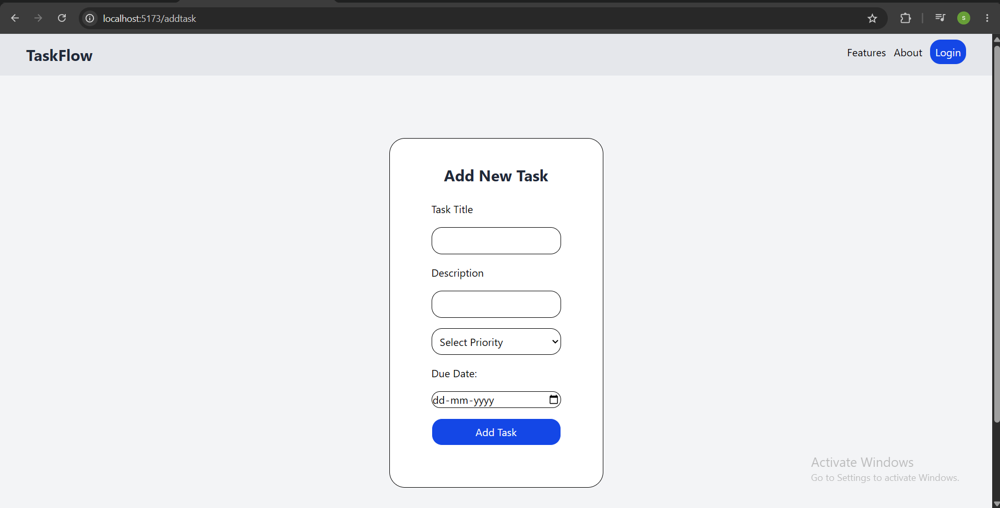
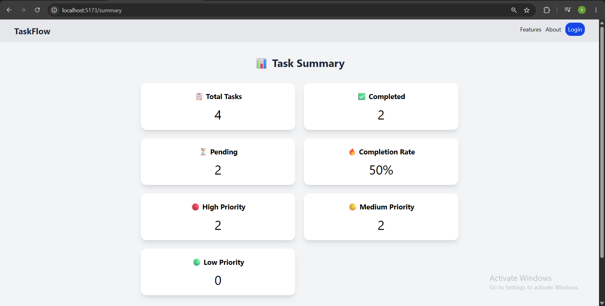

# 🚀 TaskFlow

A modern Task Management Application built using React.js.

---

## ✨ Features

- ✅ Add Task
- ✏️ Edit Task
- 🗑️ Delete Task
- ✔️ Mark Task as Completed
- 🔍 Search Tasks
- 📂 Filter Tasks (All / Completed / Pending)
- 📊 Dashboard Statistics
- 📈 Summary Page
- ⚠️ Form Validation
- 🚫 Duplicate Task Validation
- 💾 Local Storage Support
- 📱 Responsive UI

---

## 🛠️ Tech Stack

- React.js
- JavaScript (ES6+)
- HTML5
- CSS3
- Tailwind CSS
- React Router DOM
- Vite
- Local Storage

---

## 🚀 Installation

```bash
npm install
```

```bash
npm run dev
```

---

## 📸 Screenshots

### Dashboard



### Add Task



### Summary



---

## 🔮 Future Improvements

- Backend Integration
- User Authentication
- Database Support
- Dark Mode
- Task Categories
- Notifications

---

## 👩‍💻 Author

**Subasri Sakthivel**

GitHub:
https://github.com/subasrisakthivel
